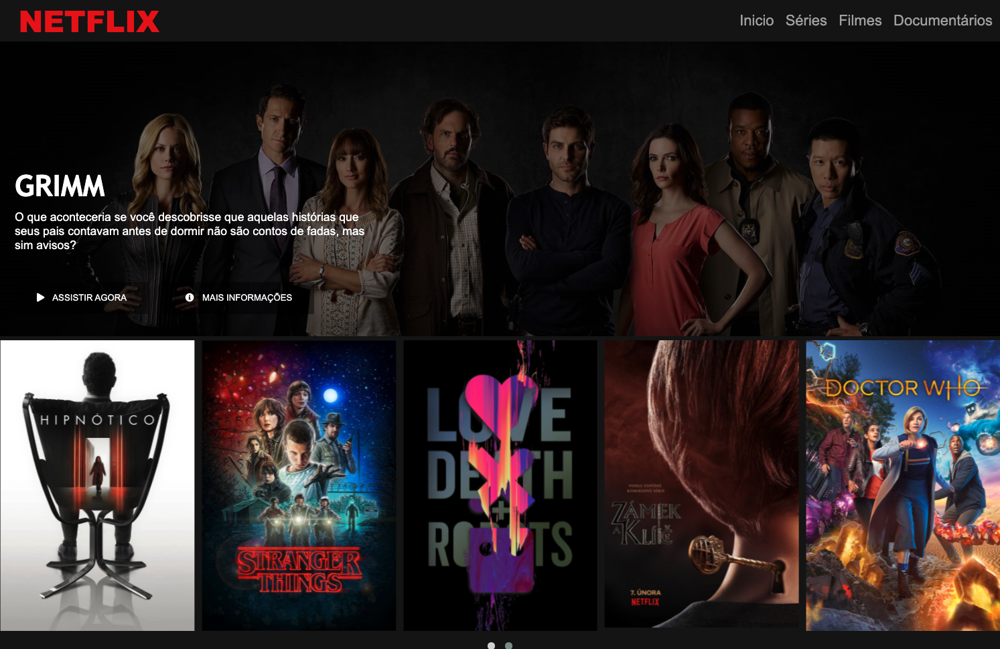

# Recriando a Interface do Netflix

## 💻 Projeto

Esse projeto foi desenvolvido através do [bootcamp HTML Web Developer](https://web.digitalinnovation.one/track/html-web-developer) oferecido pela [Digital Innovation One - DIO](https://digitalinnovation.one/). O projeto teve como objetivo recriar a interface do principal site de streaming mundial utilizando tecnologias simples como HTML5, CSS3 e JavaScript. Nesse projeto aprendi: como estruturar um layout, técnicas de CSS3 com containers e variáveis, como posicionar os elementos com Flexbox e como utilizar plugins JQuery a favor da aplicação..

O resultado da aplicação pode ser acessado através da seguinte URL: [https://frantend.github.io/netflix-clone](https://frantend.github.io/netflix-clone)

## 📋 Tecnologias 

O projeto foi desenvolvido com as seguintes tecnologias:

- HTML
- CSS
- JavaScript

## 🎨 Layout

